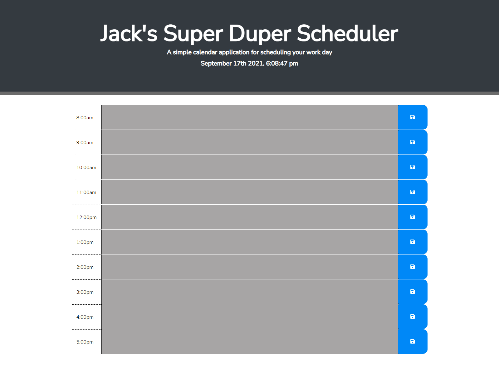

# My Portfolio
## Description
- The goal of this project was to develop a working day planner/scheduler to make tracking daily tasks more streamlined.
- Utilizing a well made scheduler can help anyone stay on top of their daily tasks and ensure proper usage of their time.
- Creating this scheduler has increased my working knowledge and utilization of bootstrap, jQuery, and javascript even more.

## Usage
- When enterering the application, simply click in the text box and input any information you need to properly schedule the day out.
- Time's are all color coordinated to make it so that you know right off the bat if the task is in the past, present or the future and will be colored as grey, green, and red respectively.
- Github repo is viewable here: https://github.com/henlowgg/Super-Duper-Scheduler
- Site is viewable at: https://henlowgg.github.io/Super-Duper-Scheduler/
- Preview: 

## Credits
- Leif E. Hetland for helping me to understand functioning code, bootstrap basics, and how to utilize JS.
- Rebecca for testing project to make sure it works.
- Rebecca's Github can be found here: https://github.com/yinzhedy
- https://coding-boot-camp.github.io/full-stack/github/professional-readme-guide for the README layout.
- https://choosealicense.com/licenses/mit/ for the copyright layout.
## License
- 

Copyright (c) [2021] [Jack Ault]

Permission is hereby granted, free of charge, to any person obtaining a copy
of this software and associated documentation files (the "Software"), to deal in the Software without restriction, including without limitation the rights to use, copy, modify, merge, publish, distribute, sublicense, and/or sell copies of the Software, and to permit persons to whom the Software is
furnished to do so, subject to the following conditions:

The above copyright notice and this permission notice shall be included in all copies or substantial portions of the Software.

THE SOFTWARE IS PROVIDED "AS IS", WITHOUT WARRANTY OF ANY KIND, EXPRESS OR
IMPLIED, INCLUDING BUT NOT LIMITED TO THE WARRANTIES OF MERCHANTABILITY,
FITNESS FOR A PARTICULAR PURPOSE AND NONINFRINGEMENT. IN NO EVENT SHALL THE
AUTHORS OR COPYRIGHT HOLDERS BE LIABLE FOR ANY CLAIM, DAMAGES OR OTHER
LIABILITY, WHETHER IN AN ACTION OF CONTRACT, TORT OR OTHERWISE, ARISING FROM, OUT OF OR IN CONNECTION WITH THE SOFTWARE OR THE USE OR OTHER DEALINGS IN THE SOFTWARE.